# MAPEOGEO Relational Mathematics Kernel — Master Scientific Synthesis & Independent Reproduction Specification

## Executive Overview

With the cryptographic sealing of **Kernel v3** (`release/kernel-v3-sealed`, commit `f8fc9fc`), the MAPEOGEO research program completes its internal prospective experimental arc. What began with the empirical anomaly of Issue **#312** has converged into a verified, six-dimensional factorized relational grammar:
\[
\boxed{
\mathcal{M} = (\Delta, I, W, \sigma, \Pi, \Gamma, \circ)
}
\]
which reconstructs mathematical identity from relational neighborhoods, prospectively incorporates external novelty to resolve internal blind spots, and maintains strict dimensional saturation ($d=6$) across five orthogonal stress axes.

This document formalizes the three overarching scientific results, documents the historical epistemological chain, and defines the two-track independent reproduction protocol for external verification.

---

## 1. The Three Foundational Results

```mermaid
flowchart TD
    subgraph Pillar 1: Relational State Emergence
        R1["Transformation Graph"] --> R2["k-Hop Relational Neighborhood Σₖ(X)"]
        R2 --> R3["Empirical Identifiability [X]<br/>(No collisions observed at k = 6)"]
    end
    subgraph Pillar 2: Self-Extension Principle
        S1["External Mathematics"] --> S2["Discovered Novelty (e.g. Γ, W tokens)"]
        S2 --> S3["Frozen Residual Boundary (e.g. B₅ → B₆)"]
        S3 --> S4["Prospective Resolution<br/>(E_regression = 0 across 55,800 records)"]
    end
    subgraph Pillar 3: Growth-Law Saturation
        G1["5 Prospective Campaigns (E₁–E₅)"] --> G2["Diversity D: 28 → 68"]
        G2 --> G3["d(D) = 6 Invariant (Δd = 0)"]
        G3 --> G4["Finite Saturation (H₂ / H₀) Strongly Preferred<br/>(ΔAICc > 24 vs Linear / Logarithmic)"]
    end
```

### Pillar 1: The Relational-State Result (Epistemological Inversion)
- **Classical Conception**: Mathematical objects are ontological primitives whose internal essences dictate their transformations.
- **MAPEOGEO Inversion**: Mathematical objects are **equivalence classes of relational neighborhoods**. An object $X$ is isolated by its coordinate-labeled relational signature:
  \[
  \Sigma_k(X) = \left\{ (r_1 \circ r_2 \circ \cdots \circ r_m) \mid \text{path length } m \le k \right\} \implies [X]
  \]
- **Empirical Identifiability**: At neighborhood radius $k=6$, no relational-signature collisions were observed in the evaluated external population ($C(6) = 0.00\%$). Together with the masked reconstruction and equivalence-class tests, this demonstrates empirical identifiability of tested mathematical states from relational neighborhoods without nominal labels over the evaluated population.

### Pillar 2: The Self-Extension Principle
- **Anti-Circular Induction**: Relational grammar expansion was never inferred from internal residuals to fit those same residuals. Instead, candidate machinery originated in completely unseen external mathematics, was characterized and frozen independently, and only subsequently applied to frozen internal explanatory boundaries:
  \[
  \mathcal{M}_n \xrightarrow{\text{external mathematics}} \Omega \xrightarrow{\text{freeze}} B_n \xrightarrow{\text{prospective resolution}} \mathcal{M}_{n+1}
  \]
- **Regression Invariance**: Across seven successive grammar milestones ($\mathcal{M}_4 \to \mathcal{M}_6^{++++}$), the cumulative clean regression rate remained strictly:
  \[
  \boxed{E_{\text{regression}} = \frac{0}{55,800} = 0.00\%}
  \]

### Pillar 3: The Growth-Law & Asymptotic Saturation Result
- **Five Orthogonal Stress Axes**: Tested against external transfer ($E_1$), new-domain diversity ($E_2$), extreme structural distance ($E_3$, $\bar{\delta} = 0.88$), combinatorial scale/interaction ($E_4$, $\bar{\kappa} = 4.38$), and foundational representation shifts ($E_5$, 9 formalisms with disjoint extractors).
- **Asymptotic Trajectory**:
  \[
  d: 6 \to 6 \to 6 \to 6 \to 6 \quad \text{across } D = [28, 38, 48, 58, 68]
  \]
  while boundary share contracted ($3.68\% \to 2.09\%$) and description cost monotonically compressed ($19.1 \to 7.8\text{ bits/state}$).
- **Anti-Offloading Guarantees**:
  - *No hidden coordinate interaction*: $\max I(C_i; C_j \mid C_{\setminus\{i,j\}}) = 0.026\text{ bits} < 0.050\text{ bits}$.
  - *No composition explosion*: $c_{\max} = 6$ throughout, composition rule growth $< 5\%$.
- **Model Selection Adjudication ($J_{\text{prospective}} = 5$)**:
  \[
  \boxed{\text{Over } D \in [28, 68], \text{ the observations favor finite dimensional saturation.}}
  \]
  Linear growth ($H_1$) and logarithmic accretion ($H_3$) were decisively rejected ($\Delta\text{AICc} > 24$). The result establishes empirical model preference over the observed diversity range, not a universal theorem of an infinite limit.

---

## 2. Definitive Semantics of the Sealed Six Coordinates

In Kernel v3, the grammar $\mathcal{M}_6^{++++}$ preserves the exact coordinate semantics established across the experimental line:

| Coordinate | Sealed Interpretation | Populated Alphabet / Values |
|:---:|:---|:---|
| **$\Delta$** | **What changes** | Observable structural change: `addition`, `removal`, `modification`, `preservation` |
| **$I$** | **What remains invariant** | Preserved invariant class: `cardinality`, `metric`, `measure`, `topology`, `algebraic_structure` |
| **$W$** | **What licenses/certifies the relationship** | Witness certificate tokens (e.g. `commutative_diagram`, `universal_property`, `cohen_poset_density_certificate`, `classical_choice_certificate`, `smt_theory_decision_certificate`) |
| **$\sigma$** | **How strongly the states may be identified** | Relational scope / identification strength: `SAME_SEMANTICS`, `EQUIVALENT_TO`, `SCOPED_OVERLAP` |
| **$\Pi$** | **Direction of structural transport** | Direction relative to arrows: `covariant`, `contravariant`, `self-dual` |
| **$\Gamma$** | **Grading/parity state** | Operator parity / $\mathbb{Z}_2$-grading phase: `even`, `odd`, `graded_mixed`, `ungraded` |
| **$\circ$** | **How admissible transformations compose** | Associative typed word composition over $(\Delta, I, W, \sigma, \Pi, \Gamma)$ with max depth $c_{\max} = 6$ |

> [!NOTE]
> **Alphabet Disambiguation**: The reported metric $a = 40$ denotes **total grammar alphabet complexity** across all coordinates and rules, and must not be equated with the cardinality of the witness certificate alphabet $|W| = 21$.

---

## 3. The Complete Historical Chain

The emergence of the relational kernel followed an unbroken experimental trajectory:

\[
\boxed{
\begin{matrix}
\textbf{\#312 (Fiber Anomaly)} \\
\downarrow \\
\textbf{Invariance Hypothesis} \\
\downarrow \\
\textbf{Blind Grammar Discovery} \\
\downarrow \\
\textbf{State Emergence } (C(6)=0) \\
\downarrow \\
\textbf{Self-Diagnosis } (B_5 \text{ Boundary}) \\
\downarrow \\
\textbf{External Self-Extension } (\Gamma \text{ Discovery}) \\
\downarrow \\
\textbf{Growth-Law Stress Testing } (E_1 \to E_5) \\
\downarrow \\
\textbf{Kernel v3 Release Sealed}
\end{matrix}
}
\]

---

## 4. Two-Track Independent Reproduction & External Falsification Protocol

To address the final remaining threat to validity—**experimenter and implementation dependence**—an external research team should execute reproduction along two distinct tracks.

### 4.1. Track A — Confirmatory Reproduction
The external team is provided the complete Kernel v3 specification (`KERNEL_V3_RELEASE_SPECIFICATION.md`) and manifests:
1. **Clean-Room Implementation**: The team authors an independent implementation from the specification without consuming MAPEOGEO codebase parsing logic.
2. **Replay Audit**: The independent implementation executes against the frozen corpora ($E_1 \dots E_5$) and verifies that it reproduces the reported six coordinates, $C(6)=0$ identifiability, zero regressions ($0/55,800$), and model preference rankings.

### 4.2. Track B — Blind Rediscovery (Gold Standard)
An isolated external team or clean-room process is provided only the mathematical corpora and evaluation protocol, with the **six-coordinate answer strictly withheld**:
1. **Unconstrained Derivation**: The team is tasked with independently deriving the minimal relational coordinate representation required to classify, compose, and reconstruct states collision-free.
2. **Structural Isomorphism Test**: The independently derived representation $M_{\text{independent}}$ is compared to $M_{\text{MAPEOGEO}}$:
   \[
   M_{\text{MAPEOGEO}} \cong M_{\text{independent}}
   \]
   Evaluation permits arbitrary renaming or invertible reparameterization, testing whether the six coordinates $(\Delta, I, W, \sigma, \Pi, \Gamma)$ are naturally rediscovered as the minimal factorized basis.

---

## 5. Protocol for an External Prospective Campaign ($E_6$)

To test the saturation hypothesis on an unseen external corpus without experimenter selection bias:

### 5.1. Temporal Custody Rules
- **Selection Timestamp**: The corpus $E_6$ must be selected and acquired **strictly after the release of Kernel v3**:
  \[
  t_{\text{selection/acquisition}} > t_{\text{release}}
  \]
- **Publication Timestamp**: The mathematical theorems and transformations themselves need not postdate the release ($t_{\text{publication}} \le t_{\text{release}}$ is valid and encouraged), cleanly separating *novelty-to-the-kernel* from *historical novelty-to-mathematics*.

### 5.2. Six Explicit Falsification Modes
Campaign $E_6$ records six distinct failure outcomes:

1. **`NEW_COORDINATE`**: Hierarchical reduction fails, discovering genuine novelty that forces $\Delta d \ge 1$ ($C_7$).
2. **`COORDINATE_COUPLING`**: Irreducible pairwise conditional mutual information $I(C_i; C_j \mid C_{\setminus\{i,j\}}) \ge 0.05\text{ bits}$ or triple interaction $I(C_i; C_j; C_k) \ge 0.05\text{ bits}$.
3. **`COMPOSITION_EXPLOSION`**: Max composition depth surges ($\Delta c_{\max} \ge 2$, i.e. $c_{\max} \ge 8$) or rule count grows by $> 50\%$.
4. **`REGRESSION`**: Any regression ($E_{\text{regression}} > 0$) observed across previously clean transformations.
5. **`REPRESENTATION_DEPENDENCE`**: Mean semantic distance $\bar{V}_R(X) \ge 0.05$ across alternative formal representations.
6. **`COMPRESSION_FAILURE`**: Description length $K(M)/N$ stops decreasing or materially increases, detecting attempts to artificially hold $d=6$ by hiding unconstrained complexity inside $W$ or rules.

---

## 6. Scientific Epilogue

If an independent implementation reproduces $d=6$ saturation across Tracks A and B while an independently selected $E_6$ fails to trigger any of the six falsification modes, the result moves from a controlled internal research program to an:
\[
\boxed{\text{independently reproduced, implementation-independent empirical regularity}}
\]
demonstrating that mathematical transformations across diverse domains, foundations, and representations admit a remarkably compact six-dimensional relational factorization.
