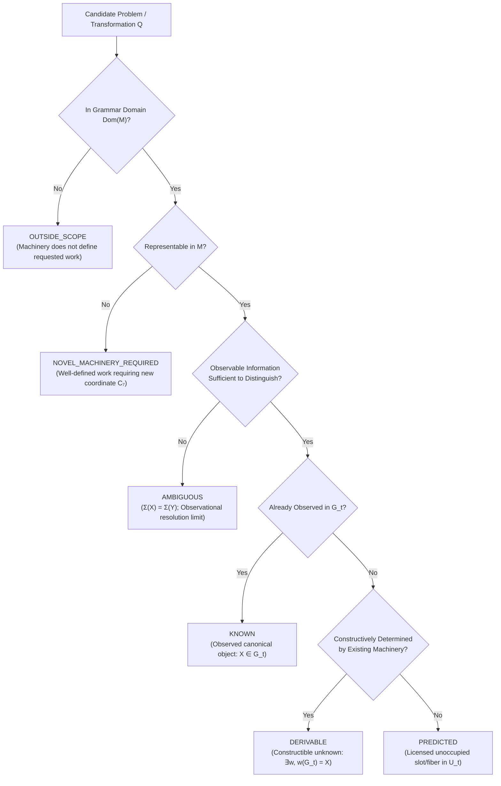

# The Unit of Work (UoW) Mathematical Frontier & Discovery Prediction Specification

## 0. Executive Mandate: From Object Ontology to Relational Work

The completion of Kernel v3 established empirical state identifiability, prospective self-extension, and observed-range dimensional saturation ($d=6$) under the six-coordinate grammar:
\[
\mathcal{M} = (\Delta, I, W, \sigma, \Pi, \Gamma, \circ)
\]
This operational success motivates a fundamental epistemological pivot in MAPEOGEO's architecture:

\[
\text{“What mathematical objects exist?”} 
\quad \longrightarrow \quad 
\boxed{\text{“What work can the present mathematical machinery perform?”}}
\]

Under this Unit of Work (UoW) framing, mathematics is not a static catalog of nominal entities; it is a **directed, typed graph of relational work**. The purpose of the kernel is not to claim discovery of an absolute philosophical boundary ($\partial\mathsf{Mathematics}$), but to construct a **rigorous, executable, and empirically falsifiable frontier**:
\[
\boxed{\partial\mathfrak{M}_{\mathrm{observed}}}
\]
and to predict admissible, unoccupied branches of mathematical work before canonical objects are constructed to occupy them.

---

## 1. The Executable Taxonomy of Mathematical Frontiers

Given any mathematical problem, conjecture, or transformation candidate $Q$, the kernel maps $Q$ into its required transformation work:
\[
Q \longrightarrow \text{required relational work} \longrightarrow (\Delta, I, W, \sigma, \Pi, \Gamma, \circ)
\]
Every candidate is classified into exactly one of six operational states:



### The Six Epistemic States

1. **`KNOWN` ($X \in G_t$)**:
   An observed, fully articulated state with explicit canonical representations in the historical graph.
2. **`DERIVABLE` ($X \notin G_t \land \exists w \in \mathcal{M}^* \text{ s.t. } w(G_t) = X$)**:
   **Constructible Unknown**: The state is not cataloged in $G_t$, but is constructively and uniquely determined by the certified composition of existing machinery (e.g. an uncomputed direct sum or standard dual).
3. **`PREDICTED` ($X^* \in U_t = \operatorname{Closure}_{\le n}(G_t, \mathcal{M}) \setminus (G_t \cup \operatorname{Derivable})$)**:
   **Licensed Unoccupied State/Fiber**: The machinery determines an **admissible structural slot or constraint class**, but not a unique constructed object. The relational boundary licenses work to enter, but no known canonical object has yet been mapped.
4. **`AMBIGUOUS` ($\Sigma(X) = \Sigma(Y)$)**:
   An observational resolution limit. Two distinct entities share identical relational signatures at the current observation depth $k$. Indicates missing witness tokens or insufficient neighborhood depth, not missing grammar dimensions.
5. **`OUTSIDE_SCOPE` ($Q \notin \operatorname{Dom}(\mathcal{M})$)**:
   The inquiry falls outside the operational semantics of declared relational transformations.
6. **`NOVEL_MACHINERY_REQUIRED` ($Q \notin \operatorname{Closure}(\mathcal{M}) \land Q \in \operatorname{Dom}(\mathcal{M})$)**:
   The problem is mathematically meaningful and structurally well-formed, but cannot be factored into $(\Delta, I, W, \sigma, \Pi, \Gamma, \circ)$. This is the exact falsification locus where an independent seventh coordinate ($C_7$) resides.

---

## 2. Pre-Revelation Scoring & Discovery Pressure Ranking

The raw closure complement $U_t$ contains a large space of admissible unoccupied states. To prevent testing arbitrary combinatorial volume, Kernel v3 assigns every frontier candidate $u \in U_t$ a **Pre-Revelation Discovery Score $S(u)$** using **strictly pre-$t$ information**:
\[
S(u) = f\left(\text{paths}(u), \text{support}(u), \text{witness\_comp}(u), \text{cert}(u), \text{prox}(u), \text{convergence}(u)\right)
\]
where:
- $\text{paths}(u)$: Number of distinct generating composition paths converging on $u$.
- $\text{support}(u)$: Centrality and connectivity of parent populated nodes.
- $\text{witness\_comp}(u)$: Completeness of required licensing witness tokens.
- $\text{cert}(u)$: Compositional certainty of boundary transitions.
- $\text{prox}(u)$: Graph distance to dense clusters of active research.
- $\text{convergence}(u)$: Cross-domain structural alignment (independent domains pointing to the same slot).

### Pre-Revelation Freezing
The full ranked frontier:
\[
U_t^* = \operatorname{Rank}\left(U_t, S\right)
\]
is serialized and cryptographically hashed **before post-$t$ mathematics is revealed**.

### Discovery Pressure Calibration Hypothesis
A calibrated model must satisfy monotonic enrichment toward top-ranked candidates:
\[
\boxed{
P(G_{>t} \mid S \text{ top } 1\%) > P(G_{>t} \mid S \text{ top } 10\%) > P(G_{>t} \mid U_t) > P(G_{>t} \mid R_t^{\text{matched}})
}
\]

---

## 3. The Retrospective Prospective Discovery Protocol

```mermaid
sequenceDiagram
    participant Origin as Rolling Origin t (e.g. 1900..2010)
    participant Kernel as Frozen Kernel v3 (Blinded Interface)
    participant Frontier as Ranked Frontier U*_t
    participant Controls as Matched Controls R_matched
    participant Future as Unmasked Mathematics (t + h)

    Origin->>Kernel: Ingest G_t (strict t_publication ≤ t; semantic backdating)
    Kernel->>Frontier: Generate U_t & score S(u)
    Kernel->>Controls: Sample R_matched (degree, domain, depth matched)
    Frontier->>Frontier: Freeze and cryptographically hash U*_t & R_matched
    Origin->>Future: Reveal mathematics discovered at horizons h ∈ {5, 10, 25, 50} yrs
    Future->>Frontier: Measure HR, precision@k, recall@k, time-to-discovery T_u
```

### 3.1. Rolling Historical Origins & Prediction Horizons
Rather than relying on isolated epochs, the campaign executes across rolling historical origins every 10 years:
\[
t \in \{1900, 1910, 1920, 1930, 1940, 1950, 1960, 1970, 1980, 1990, 2000, 2010\}
\]
For each origin $t$, predictions are evaluated across four fixed time horizons:
\[
h \in \{5, 10, 25, 50\}\text{ years}
\]
generating multi-horizon discovery curves: $P(\text{occupation by } t+h \mid U_t)$.

### 3.2. Semantic Backdating & Anti-Leakage Protocol
To prevent modern conceptual terminology from leaking backward into past graphs:
1. **Source Material Blindness**: $G_t^{\text{historical}}$ is constructed exclusively from literature and documents published on or before year $t$:
   \[
   t_{\text{publication}}(X) \le t
   \]
2. **Vocabulary Sanitization**: Kernel v3’s computational machinery remains frozen, but its vocabulary interface is blinded to all terms, names, and formalisms created after $t$.
3. **Custody Audit**: The ranked frontier $U_t^*$ and matched controls $R_t^{\text{matched}}$ are committed and hashed with an immutable timestamp before any post-$t$ records are processed.

### 3.3. Matched Control Cohorts
Because mathematics does not arrive uniformly across a graph, raw discovery ratios are invalid. Every candidate $u \in U_t$ is paired with a control candidate $r \in R_t^{\text{matched}}$ matched on pre-$t$ covariates:
- Graph degree and local clustering coefficient
- Distance from populated mathematics
- Disciplinary subfield / domain
- Relational dependency depth
- Number of candidate operator words
- Representation richness
- Neighborhood publication density / historical citation velocity

---

## 4. Primary Statistical Endpoints

### 4.1. Survival Analysis & Hazard Ratio (Time-to-Discovery)
Let $T_u$ be the elapsed time until a frontier state is first occupied by a published mathematical object:
\[
T_u = \inf \{ \tau > 0 \mid \text{state } u \text{ is occupied at } t + \tau \}
\]
Using a Cox proportional hazards model, we measure the **Discovery Hazard Ratio**:
\[
\boxed{
\text{HR}_{\text{discovery}} = \frac{h(t \mid U_t)}{h(t \mid R_t^{\text{matched}})}
}
\]
- **Confirmatory Success**: $\text{HR}_{\text{discovery}} > 1.0$ with $95\%$ bootstrap confidence interval excluding $1.0$, demonstrating that predicted branches are occupied **significantly sooner** than matched opportunities.

### 4.2. Predictive Concentration Metrics
For top-$k$ fractions ($k \in \{0.1\%, 1\%, 5\%, 10\%\}$):
- **Precision@$k$**: $\frac{|G_{>t} \cap \operatorname{TopK}(U_t)|}{k \cdot |U_t|}$
- **Recall@$k$**: $\frac{|G_{>t} \cap \operatorname{TopK}(U_t)|}{|G_{>t}|}$
- **Enrichment Factor@$k$**: $\frac{\text{Precision@}k}{\text{Precision}(R_t^{\text{matched}})}$
- **Mean Reciprocal Rank (MRR)**: Average rank of the first occupied frontier slot.

---

## 5. The Live 2026 Prospective Frontier Protocol

Upon historical backtesting demonstrating that empty relational states predict future mathematical occupation:

```
               THE FULL UoW DISCOVERY LIFECYCLE
┌────────────────┐     ┌────────────────┐     ┌────────────────┐
│  Observe Work  │ ──> │ Infer Machinery│ ──> │ Map Known (G)  │
└────────────────┘     └────────────────┘     └────────────────┘
                                                       │
                                                       ▼
┌────────────────┐     ┌────────────────┐     ┌────────────────┐
│   Construct    │ <── │ Predict Slots  │ <── │ Compute Gap    │
│  Mathematics   │     │    (U*₂₀₂₆)    │     │   (Closure\G)  │
└────────────────┘     └────────────────┘     └────────────────┘
```

1. **Freeze Present Graph ($G_{2026}$)**: Ingest all cataloged mathematics as of October 2026.
2. **Generate Frontier Complement**:
   \[
   U_{2026} = \operatorname{Closure}_{\le 6}(G_{2026}, \mathcal{M}_6^{++++}) \setminus (G_{2026} \cup \operatorname{Derivable})
   \]
3. **Score & Rank**: Compute $S(u)$ and isolate the top candidates:
   \[
   \boxed{U_{2026}^* = \operatorname{TopK}(U_{2026}, S)}
   \]
4. **Cryptographic Pre-Commitment**: Export and publicly hash $U_{2026}^*$ with individual **Prediction Work Certificates** before conducting research on the candidate slots.
5. **Constructive Exploration**: Formulate targeted mathematical investigations aimed specifically at constructing the objects that satisfy the relational constraints of $U_{2026}^*$.

This closes the Units of Work loop: moving from describing existing mathematics to predicting where mathematical discovery should occur next, and then actively constructing it.
