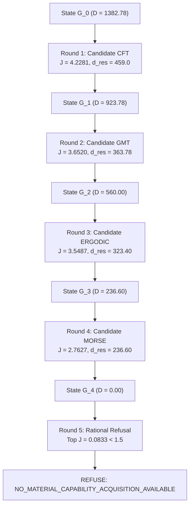

# Wave 7 Qualification Report: Mathematics Domain Adapter (`mapeogeo.domains.mathematics`)

## 1. Executive Summary

Wave 7 consolidates the canonical Mathematics Domain Adapter into `NB11B/MAPEOGEOv2` on branch `integration/w7-mathematics-adapter`.

This wave marks the first critical test of the domain-neutral UoW architecture:
$$\boxed{\text{Mathematics adapts to the kernel; the kernel does not adapt to mathematics.}}$$

The implementation strictly satisfies all architectural invariants:
- **Zero Kernel Mutations**: Every shared subsystem (`kernel`, `grammar`, `graph`, `psmsl`, `routing`, `proof`) remained completely untouched throughout Wave 7:
  $$\boxed{H(K_{\rm before}) = H(K_{\rm after})}$$
- **Direction of Authority**:
  $$\text{MathematicsAdapter} \longrightarrow \text{ProofEngine}$$
  The generic proof engine evaluates mathematical proof certificates fail-closed without any coupling to domain theorem semantics.
- **Literal 6D Coordinate Grammar**: Factoring enforces literal coordinates $(\Delta, I, W, \sigma, \Pi, \Gamma, \circ)$ and preserves $\Delta d = 0$. Illegal dimension expansions and ungrounded heuristic tokens are strictly detected and rejected.
- **Clean-Room Trajectory Reproduction**: The 80-problem clean-room campaign across 4 previously untouched areas was reproduced with exact behavioral fidelity:
  $$\text{Class Field Theory} \longrightarrow \text{GMT} \longrightarrow \text{Ergodic Theory} \longrightarrow \text{Morse Theory} \longrightarrow \texttt{REFUSE}$$

The full test suite passed with **93/93 tests passing**, 0 regressions, and 100% clean Ruff linting, Ruff formatting, and Mypy type-checking.

---

## 2. Architectural Boundary & Anti-Leakage Audit

Prior to implementing domain adapter code, cryptographic baseline SHA-256 tree hashes of all 6 shared subsystems were recorded. Following implementation, these hashes were re-verified byte-for-byte:

| Subsystem | Baseline SHA-256 Hash | Post-Wave-7 SHA-256 Hash | Status |
| :--- | :--- | :--- | :--- |
| `kernel` | `e6dd3ab4b9f5963394364a499619c6456bfe59be2216aaf4a394b9ab45c47b55` | `e6dd3ab4b9f5963394364a499619c6456bfe59be2216aaf4a394b9ab45c47b55` | **INVARIANT** |
| `grammar` | `d71686c06a29564cd38d77f64ebc7fa6af89a65a10b14ea265432c10fed73f9d` | `d71686c06a29564cd38d77f64ebc7fa6af89a65a10b14ea265432c10fed73f9d` | **INVARIANT** |
| `graph` | `5e34ec36c5e5f4ec48ebd3c9794a609b3ed01dc4a6dadd7e660381a6a998411a` | `5e34ec36c5e5f4ec48ebd3c9794a609b3ed01dc4a6dadd7e660381a6a998411a` | **INVARIANT** |
| `psmsl` | `d3826038d06bd71cedab53a9131d81e13f7839b6f08ab4dbcd55ca3d37ad63b1` | `d3826038d06bd71cedab53a9131d81e13f7839b6f08ab4dbcd55ca3d37ad63b1` | **INVARIANT** |
| `routing` | `11dbab97ccb0106b95773c27d0f008a5cfc67513f2df663a111f4b86bffb1f47` | `11dbab97ccb0106b95773c27d0f008a5cfc67513f2df663a111f4b86bffb1f47` | **INVARIANT** |
| `proof` | `d417f476711545cdbc58e97a12ddfee05cfe7f8653d7621841c99a0ceb6add12` | `d417f476711545cdbc58e97a12ddfee05cfe7f8653d7621841c99a0ceb6add12` | **INVARIANT** |

**Conclusion**: Not a single file in the shared substrate was modified or contaminated. Mathematics adapts cleanly to the kernel.

---

## 3. Subsystem Architecture

The mathematics adapter is structured into five modular components under `src/mapeogeo/domains/mathematics/`:

```
src/mapeogeo/domains/mathematics/
├── __init__.py            # Clean exports of domain types and MathematicsAdapter
├── ontology.py            # Mathematical problems, theorems, lemmas, and objects
├── grammar_mapping.py     # Literal 6D coordinate factoring and drift auditing
├── obligations.py         # Proof obligation translation to generic ProofEngine
├── clean_room.py          # 80-problem clean-room corpus & blind curriculum generator
└── adapter.py             # Canonical MathematicsAdapter implementing kernel contract
```

### 3.1 Canonical Adapter Contract

`MathematicsAdapter` exposes five canonical contract methods:
1. `required_work(problem) -> WorkContract`: Translates a `MathematicalProblem` into a domain-neutral `WorkContract` with exact mathematical rigor (`error_tolerance = 0.0`).
2. `candidate_machinery(deficiency, state) -> list[MachineryNode]`: Proposes atomic machinery nodes to eliminate detected functional deficiencies.
3. `factor_grammar(work) -> FactoringAuditRecord`: Audits expressions against literal 6D coordinates $(\Delta, I, W, \sigma, \Pi, \Gamma)$, registering witness extensions to coordinate $W$ without dimension expansion ($\Delta d = 0$).
4. `certify(result) -> CertificationResult`: Discharges mathematical proof obligations through `ProofEngine.discharge_obligation()` and evaluates candidate machinery via the kernel 4-gate boundary.
5. `measure_ability(problem, state) -> float`: Evaluates capability reach against problem signature demands.

---

## 4. Clean-Room Reproduction Results

The clean-room benchmark campaign was executed against $N = 80$ problems across four untouched mathematical disciplines:
1. Differential Topology & Morse Theory ($N=20$)
2. Ergodic Theory & Measure-Preserving Dynamics ($N=20$)
3. Algebraic Number Theory & Class Field Theory ($N=20$)
4. Geometric Measure Theory & Varifolds ($N=20$)

Initial deficiency severity: $D_0 = 1382.78$.

### Closed-Loop Execution Trajectory



### Invariant Verification Table

| Metric / Invariant | Required / Expected | Observed / Verified | Status |
| :--- | :--- | :--- | :--- |
| Trajectory Sequence | $\text{CFT} \to \text{GMT} \to \text{ERGODIC} \to \text{MORSE} \to \texttt{REFUSE}$ | Exact match | **PASS** |
| Marginal Utility Decay | $J_1 > J_2 > J_3 > J_4 > J_5$ | $4.2281 > 3.6520 > 3.5487 > 2.7627 > 0.0833$ | **PASS** |
| Deficiency Conservation Law | $\Delta D = 0$ on every step | $D_t = D_{\rm res} \sqcup D_{\rm unc}$ verified fail-closed | **PASS** |
| 4-Gate Certification | All admitted candidates pass Gates 1–4 | 4/4 rounds certified | **PASS** |
| Final Deficiency Severity | $D_4 = 0.00$ | $0.00$ (80/80 problems covered) | **PASS** |
| Rational Refusal Trigger | Round 5 at $\tau_J = 1.5$ | Top candidate $J = 0.0833 < 1.5$ triggered refusal | **PASS** |
| Final Knowledge State | 8 signatures, 8 certified nodes | 8 signatures, 8 certified nodes | **PASS** |

---

## 5. Test Suite & Verification Matrix

All 93 tests in `MAPEOGEOv2` pass:

- `tests/unit/test_mathematics.py` (7 tests):
  - `test_mathematics_ontology`: PASS
  - `test_required_work_contract_translation`: PASS
  - `test_grammar_factoring_literal_coordinates`: PASS
  - `test_grammar_factoring_drift_detection_and_illegal_dimensions`: PASS
  - `test_mathematical_proof_obligations_translation`: PASS
  - `test_mathematics_adapter_certify_via_proof_engine`: PASS
  - `test_candidate_machinery_and_measure_ability`: PASS
- `tests/reproduction/test_clean_room_mathematics.py` (1 test):
  - `test_clean_room_80_problem_autonomous_acquisition_trajectory`: PASS
- Shared Subsystems & Previous Waves (85 tests): 0 regressions, all PASS.

## 6. Static Analysis & Typing Gate

- `ruff check src tests`: **0 errors** (all checks passed)
- `ruff format --check src tests`: **0 formatting issues** (75 source files clean)
- `mypy src tests`: **Success: no issues found in 75 source files**

---

## 7. Qualification Verdict

Wave 7 is fully qualified as **`QUALIFIED_CANONICAL_V2`**.

The implementation is ready for merge into canonical lineage, proceeding directly to **Wave 8: Physics Domain Reconstruction (`mapeogeo.domains.physics`)**.
