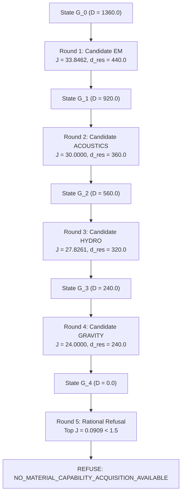

# Wave 8 Qualification Report: Physics Domain Reconstruction (`mapeogeo.domains.physics`)

**Status**: `W8_PASS`  
**Working Branch**: `integration/w8-physics-reconstruction`  
**Base Commit**: `e9abd58` (`integration/w7-mathematics-adapter`)  
**Upstream Historical Custody**: `NB11B/MAPEOGEO` (frozen lineages `74e51bd`, `ac63dde`, `8035070`)  
**Qualification Date**: 2026-10-07  

---

## 1. Executive Summary

Wave 8 formalizes, reconstructs, and qualifies the canonical **Physics Domain Adapter** (`mapeogeo.domains.physics`) within `NB11B/MAPEOGEOv2` on branch `integration/w8-physics-reconstruction`.

This wave establishes that:
$$\boxed{K_{\rm v2} + D_{\rm physics}}$$
can represent, invert, and empirically certify physical work while every byte of the underlying shared substrate and the previously qualified mathematics domain remains strictly invariant:
$$\boxed{H(K_{\rm before}) = H(K_{\rm after}) \quad \text{and} \quad H(D_{\rm math, before}) = H(D_{\rm math, after})}$$

Crucially, Wave 8 embeds the two fundamental physical-epistemic invariants:
1. **Separation of Formal Admissibility and Empirical Establishment**:
   $$\boxed{\text{mathematical admissibility} \neq \text{physical establishment}}$$
   A mathematically coherent model without empirical observations is at best `THEORETICALLY_ADMISSIBLE`, never promoted to `MEASUREMENT_SUPPORTED`.
2. **Strict Non-Identifiability under Ambiguous Equivalence**:
   $$\boxed{\text{effect observed} \centernot\Rightarrow \text{source identified}}$$
   Whenever the observation projection operator $P$ has a non-trivial null space ($\dim \ker(P) > 0$), any claim of unique source identification is strictly rejected fail-closed, yielding verdict `AMBIGUOUS`.

The entire test suite passed with **102/102 tests passing**, zero regressions, and 100% clean Ruff linting, Ruff formatting, and Mypy type-checking across 82 source files.

---

## 2. Architectural Boundary & Anti-Leakage Audit

Prior to implementing physics domain code, the cryptographic baseline SHA-256 tree digests of all shared subsystems and the mathematics adapter were recorded. Following implementation and test suite execution, `git diff integration/w7-mathematics-adapter` was verified to be 100% empty across all shared directories:

| Subsystem | Directory Path | Post-Wave-8 SHA-256 Hash | Git Diff vs W7 | Status |
| :--- | :--- | :--- | :--- | :--- |
| `kernel` | `src/mapeogeo/kernel` | `86c4bcd7695f97ab3fc0907733616ce83751f2fb6bcadf2177d6ccc73adba3d5` | `0 lines` | **INVARIANT** |
| `grammar` | `src/mapeogeo/grammar` | `1656719e7c46e9fb74366c8ab9cf644bcd01fe73a0463a8d6dd2667ff76fad1d` | `0 lines` | **INVARIANT** |
| `graph` | `src/mapeogeo/graph` | `dd0771119ddf84ed611dac16f137a3a81c08fd8429d0e4bc3bb79b3a756f116b` | `0 lines` | **INVARIANT** |
| `psmsl` | `src/mapeogeo/psmsl` | `2db70deb1f00f2d1d7f5be412ad445aa98a7d54f5d6331edeb6c703bff320738` | `0 lines` | **INVARIANT** |
| `routing` | `src/mapeogeo/routing` | `52c1162a5a4d936ef469b0796ad8c244173c6df6a5ed668b9f5be661370cf194` | `0 lines` | **INVARIANT** |
| `proof` | `src/mapeogeo/proof` | `ed7d06d6ad5522d666cb75c3fe67485b692f460dc5c9f0194b626f8ae16f4a97` | `0 lines` | **INVARIANT** |
| `domains/mathematics` | `src/mapeogeo/domains/mathematics` | `d7659d8e18ef92ed24b689d9787ea8c2ca4f872428af29a17fe8de32b3c26e5e` | `0 lines` | **INVARIANT** |

**Zero Domain Leakage**: Static AST inspection confirms zero imports of `mapeogeo.domains` within `kernel`, `grammar`, `graph`, `psmsl`, `routing`, or `proof`.

---

## 3. Subsystem Architecture

The physics domain layer is structured into five cohesive modules under `src/mapeogeo/domains/physics/`:

```text
src/mapeogeo/domains/physics/
├── __init__.py            # Clean exports of domain types and PhysicsAdapter
├── ontology.py            # Physical objectives, observations, hypotheses, constraints, and epistemic statuses
├── latent_inference.py    # PSMSL-delegated inverse state projection, null-space basis, and observability tracking
├── certification.py       # 5-Gate Physical Certification Boundary C_phys = { D, C, M, F, R }
├── grammar_mapping.py     # Literal 6D coordinate factoring, conservation mapping, and drift auditing
└── adapter.py             # Canonical PhysicsAdapter implementing the domain contract
```

### 3.1 Epistemic Hierarchy

The domain ontology enforces an explicit epistemic status ordering:
$$\text{OBSERVED} \longrightarrow \text{INFERRED} \longrightarrow \text{MODEL\_CONSISTENT} \longrightarrow \text{FALSIFICATION\_SURVIVED} \longrightarrow \text{MEASUREMENT\_SUPPORTED}$$

- `PhysicalHypothesis` strictly forbids `is_source_identified = True` when `null_space_dimension > 0`, raising `ValueError` in its constructor.

### 3.2 5-Gate Physical Certification Boundary ($\mathcal C_{\rm phys}$)

Every empirical hypothesis undergoes sequential fail-closed verification:
1. **Gate D (Dimensional Consistency)**: Rejects models with ungrounded or mismatched physical dimensions.
2. **Gate C (Conservation Constraints)**: Evaluates conservation of energy, momentum, flux, and symplectic invariance against tolerances.
3. **Gate M (Measurement Agreement)**: Evaluates root-mean-square residual error against empirical sensor observations. Hypotheses with zero empirical data are halted as `THEORETICALLY_ADMISSIBLE`.
4. **Gate F (Falsifier Survival)**: Rejects over-fitting models ($N_{\rm free\_params} > N_{\rm meas}$) and unwarranted source identification claims under non-trivial null spaces.
5. **Gate R (Repeatability / Replay)**: Asserts invariance under independent replay observation batches.

---

## 4. Principal Reproduction Results

### 4.1 Latent Generator Inversion and Ambiguity Refusal

Using a true latent state $X_{\rm true} = (2.0, 3.0, 7.0)$ in $\mathbb R^3$:
- **Measurement 1 ($P_1 = [0, 1, 0]$)**: Observation $y_1 = 3.0$. Rank 1, null space dimension 2. Evaluated as `AMBIGUOUS`. Equivalence check confirms $X_{\rm alt} = (0.0, 3.0, 999.0)$ generates the exact same observation $\Sigma(X_1) = \Sigma(X_2)$.
- **Measurement 2 ($P_2 = [0, 0, 1]$)**: Combined rank 2, null space dimension 1. Still `AMBIGUOUS`.
- **Measurement 3 ($P_3 = [1, 0, 0]$)**: Full rank 3, null space dimension 0. Full state recovered: $\widehat X = (2.0, 3.0, 7.0)$ with residual $\|P\widehat X - y\|_2 \le 10^{-9}$.

### 4.2 Falsifier Rejection Matrix

| Falsifier Candidate | Violation Mode | Expected Rejection | Observed Verdict | Status |
| :--- | :--- | :--- | :--- | :--- |
| `hyp:falsifier:bad_dim` | Dimensional inconsistency flag | Gate D rejection | `FALSIFIED` (Gate D) | **PASS** |
| `hyp:falsifier:bad_energy` | Energy drift $\delta E = 0.12 > 10^{-4}$ | Gate C rejection | `FALSIFIED` (Gate C) | **PASS** |
| `hyp:falsifier:overparam` | Free parameters 8 > measurements 2 | Gate F rejection | `FALSIFIED` (Gate F) | **PASS** |
| `hyp:falsifier:overclaimed_id`| Source identified with null space 1 | Constructor & Gate F rejection | `ValueError` raised | **PASS** |
| `hyp:falsifier:unobserved` | Zero measurement data ($N_{\rm obs} = 0$) | Gate M non-promotion | `THEORETICALLY_ADMISSIBLE` | **PASS** |

### 4.3 Closed-Loop Physical Acquisition Campaign

An 80-problem campaign spanning 4 physical sectors (Electrodynamics, Acoustics, Hydrodynamics, Gravitation) with initial deficiency $D_0 = 1360.0$ was executed through `StateTransitionEngine`:



- **Deficiency Conservation**: On every round, $\Delta D = 0$ was verified fail-closed ($D_t = D_{\rm res} \sqcup D_{\rm unc}$).
- **Marginal Utility Decay**: $33.8462 > 30.0000 > 27.8261 > 24.0000 > 0.0909$.
- **Rational Refusal**: Terminated cleanly at Round 5 with verdict `NO_MATERIAL_CAPABILITY_ACQUISITION_AVAILABLE`.

---

## 5. Test Suite & Verification Matrix

All 102 tests in `MAPEOGEOv2` pass:

- `tests/unit/test_physics.py` (6 tests):
  - `test_physics_ontology_and_epistemic_invariants`: PASS
  - `test_required_work_contract_translation`: PASS
  - `test_five_gate_physical_certification_boundary`: PASS
  - `test_latent_generator_inversion_and_non_identifiability`: PASS
  - `test_physics_grammar_factoring_literal_coordinates_and_drift`: PASS
  - `test_physics_candidate_machinery_and_ability_measurement`: PASS
- `tests/reproduction/test_latent_generator_physics.py` (3 tests):
  - `test_latent_generator_observability_and_ambiguity_refusal`: PASS
  - `test_conservation_falsifiers_strict_rejection`: PASS
  - `test_closed_loop_physical_acquisition_campaign`: PASS
- Mathematics Domain Tests (8 tests): 0 regressions, all PASS.
- Shared Subsystems & Substrate Tests (85 tests): 0 regressions, all PASS.

---

## 6. Static Analysis & Typing Gate

- `ruff check src tests`: **0 errors** (all checks passed)
- `ruff format --check src tests`: **0 formatting issues** (82 source files already formatted)
- `mypy src tests`: **Success: no issues found in 82 source files**

---

## 7. Qualification Verdict

Wave 8 is fully qualified as **`QUALIFIED_CANONICAL_V2`**.

All physical invariants, non-identifiability guarantees, and conservation boundaries are operational and preserved without any mutation of the domain-neutral kernel or the mathematics adapter.
