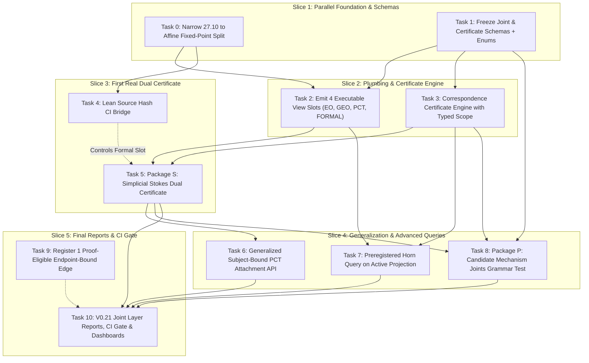

# MAPEOGEO Joint-Layer Implementation Plan (v0.21)

> Execute every task test-first. Record the failing test command before changing production code.  
> Keep `data/mapeogeo_v0_11_graph.json.gz` byte-identical.  
> Do not ingest a new textbook corpus in this plan.  
> Dedicated branch: `agent/joint-layer-v0-21` — do not merge until independent review.  
> Companion design: `docs/plans/2026-09-17-joint-layer-design.md`

---

## 1. Global Gates & Invariants (Every Task)

```bash
sha256sum data/mapeogeo_v0_11_graph.json.gz
# expect 409a648d8563bc4a027dc3dc29fc53722d11bc489462a0f3d1f71bd4f272544d
git diff --exit-code -- data/mapeogeo_v0_11_graph.json.gz
```

**Forbidden strings in active reports**:
- `100% verified`, `fully verified`, `same semantics from Betti`, `PCT proves`
- Any joint type listed as `SAME_SEMANTICS`

---

## 2. Execution Order & Phasing



---

## Task 0 — Narrow 27.10 to Affine Fixed-Point Split & Demote Gallier Binding

**Objective**: Remove the mathematical overclaim in theorem 27.10 without expanding into the full Euclidean affine-isometry classification theorem.

**Files:**
- `MAPEOGEOFormal/PinchQuartet.lean`
- `formal/pinch_bindings_v0_11.json`
- `formal/pinch_quartet_v0_10.json`
- `tests/test_pinch_intake_v0_11.py`
- `tests/test_pinch_27_10_scope.py` (new)
- `docs/V0_10_PINCH_QUARTET_PROMOTION_REPORT.md` (historical; record discrepancy note without rewriting sealed baseline)

**RED tests:**
```bash
pytest -q tests/test_pinch_27_10_scope.py
```
Tests must fail if:
1. Lean declaration name claims `affine_isometry` without orthogonality / isometry hypotheses.
2. `h_split` contains the tautological translation $A(x_0 - x_0) + x_0 = x_0$.
3. JSON bindings list Gallier 27.10 as full `KERNEL_VERIFIED` without `SCOPED_OVERLAP` and a `WOUND` record.

**Implementation**:
- Rename Lean theorem to `affine_map_split_along_fixed_direction`.
- Demote binding in `pinch_bindings_v0_11.json` to `SCOPED_OVERLAP`.
- Record a `WOUND` with reason `CONTRACT_NARROWER_THAN_SOURCE`.

**GREEN + commit**: `fix(formal): narrow 27.10 to affine split with scoped overlap and wound`

---

## Task 1 — Freeze Joint & Certificate Schemas with Typed Scopes & Enums

**Objective**: Define machine-checked JSON schemas enforcing role-labelled feet, typed scope records, closed joint types, and strict non-promotion rules.

**Files:**
- `schema/mapeogeo-core.schema.json`
- `schema/mapeogeo-joint.schema.json` (new)
- `schema/mapeogeo-certificate.schema.json` (new)
- `formal/joint_type_registry_v0_21.json` (new)
- `tests/test_joint_schema_v0_21.py` (new)

**Key Schema Specifications:**
1. **Executable View Slots**: Exactly 4 executable view slots on canonical objects: `eo`, `geo`, `pct`, `formal`. Source provenance (`NATURAL`) is stored outside the executable view registry.
2. **Joint Types Closed Enum**: `ACTS_ON`, `LINEARIZATION_OF`, `CONTRACTION_OF`, `MONOTONE_ALONG`, `OBSTRUCTION_TO`, `BLOWS_UP_AS`, `SURGERY_OF`, `NERVE_OF`, `CHAIN_OF`, `COMPARISON_MODEL`, `SCOPED_TRANSFER`.
3. **Role-Labelled Feet**: Array of `{"role": str, "object_id": str, "statement_hash": str}`.
4. **Typed Scope Schema**: `domain`, `dimension`, `coefficient_ring`, `regularity`, `orientation_convention`, `boundary_convention`, `parameter_range`, `exceptional_cases`.
5. **Promotion Prohibitions**: Forbid `SAME_SEMANTICS` as a joint type or auto-emitted edge.

**RED tests:**
```bash
pytest -q tests/test_joint_schema_v0_21.py
```

**GREEN + commit**: `feat(schema): freeze v0.21 joint, typed-scope, and certificate schemas`

---

## Task 2 — View Slots on Canonical Objects (Additive Projection)

**Objective**: Emit in-memory 4-slot view registry (`eo`, `geo`, `pct`, `formal`) during graph reconstruction without touching sealed files.

**Files:**
- `scripts/view_slots_v0_21.py` (new)
- `scripts/reconstruct_pipeline.py` (integrate view slot emitter)
- `tests/test_view_slots_v0_21.py` (new)

**Rules:**
- Historical nodes reconstruct as `ABSENT` across all 4 slots.
- `INAPPLICABLE` is a valid state strictly on `pct` (for smooth-only objects lacking nerves).
- Emits derived evidence to `evidence/v0_21_view_slots.json` without modifying `data/`.

**RED tests:**
```bash
pytest -q tests/test_view_slots_v0_21.py
```

**GREEN + commit**: `feat(graph): emit fail-closed 4-slot view registry without touching sealed baselines`

---

## Task 3 — Dual-Prover Correspondence Certificate Engine & Scope Comparator

**Objective**: Implement certificate verification requiring explicit quorum ($\ge 2$ independent witnesses) and deterministic typed scope comparison.

**Files:**
- `mapeogeo/analysis/scope_comparator.py` (new)
- `scripts/correspondence_certificate.py` (new)
- `formal/correspondence_certificates_v0_21.json` (new)
- `tests/test_correspondence_certificate.py` (new)

**Quorum & Scope Rules:**
1. `CERTIFIED` requires $\ge 2$ independent witnesses: `EO`, `GEO`, `PCT` (B4+), `FORMAL` (`KERNEL_VERIFIED`).
2. Reject single-view certifications, `NATURAL`-only citations, duplicate digests, and shared-producer aliases.
3. Call `ScopeComparator.are_compatible(scope_a, scope_b)` (dimension overlap, ring subtyping, matching orientations/boundaries).
4. Non-empty `nonclaims` required.

**RED tests:**
```bash
pytest -q tests/test_correspondence_certificate.py
```

**GREEN + commit**: `feat(dual): add correspondence certificate engine with typed scope comparator and quorum enforcement`

---

## Task 4 — Bind Source Statement Hashes in Lean (CI Bridge)

**Objective**: Ensure Lean theorems contain compile-time hash constants binding them to JSON source declarations.

**Files:**
- `MAPEOGEOFormal/SourceBound.lean`
- `MAPEOGEOFormal/ProofPaths.lean`
- `MAPEOGEOFormal/PinchQuartet.lean`
- `MAPEOGEOFormal/PinchV011.lean`
- `MAPEOGEOFormal/WaveF4.lean`
- `scripts/check_lean_source_hashes.py` (new)
- `tests/test_lean_source_hash_bridge.py` (new)

**RED tests:**
```bash
pytest -q tests/test_lean_source_hash_bridge.py
```

**GREEN + commit**: `feat(formal): bind source statement hashes into Lean and CI checker`

---

## Task 5 — Package S: Simplicial Stokes Dual Certificate

**Objective**: First accepted dual correspondence certificate connecting discrete exterior calculus, oriented geometry, and PCT B4/B5 boundary complex.

**Files:**
- `scripts/stokes_package_v0_21.py` (new)
- `mapeogeo/pct/attachments/stokes_simplex.py` (new)
- `formal/joints_stokes_v0_21.json` (new)
- `formal/correspondence_certificates_v0_21.json` (append Stokes certificate)
- `tests/test_stokes_package_v0_21.py` (new)

**Mathematical Constraints**:
- Scope: Discrete/simplicial Stokes on oriented $n$-simplices ($n \in \{1, 2\}$) over $\mathbb{Q}$.
- $\partial$ is boundary operator in B4 chain complex ($C_n \xrightarrow{\partial} C_{n-1}$).
- B5 object is boundary-commuting chain map ($\langle d\alpha, \sigma \rangle = \langle \alpha, \partial\sigma \rangle$).
- Tests:
  * Orientation reversal: $\langle \alpha, -\sigma \rangle = -\langle \alpha, \sigma \rangle$.
  * Boundary-square-zero: $\partial^2 = 0$.
  * Coboundary-square-zero: $d^2 = 0$.
  * Incidence transpose: boundary matrix $B = D^T$.
- Formal view: `ABSENT` unless real Mathlib theorem attached in Task 4.
- Explicit nonclaims: Not smooth de Rham; not general geometric currents; not full source text proof.

**RED tests:**
```bash
pytest -q tests/test_stokes_package_v0_21.py
```

**GREEN + commit**: `feat(joint): certify simplicial Stokes dual correspondence (EO+GEO+PCT)`

---

## Task 6 — Generalized Subject-Bound PCT Attachment API

**Objective**: Generalize attachment of B0–B5 complexes to canonical objects and joints with explicit applicability state.

**Files:**
- `mapeogeo/pct/attach.py` (new)
- `scripts/pct_attach_v0_21.py` (new)
- `tests/test_pct_attach_v0_21.py` (new)
- `tests/pct/test_models_contracts.py` (extend)

**API**:
```python
attach_pct(subject_id: str, subject_hash: str, complex_data: Any, applicability: str, b_level: str) -> AttachmentRecord
```

**RED tests:**
```bash
pytest -q tests/test_pct_attach_v0_21.py
```

**GREEN + commit**: `feat(pct): generalized subject-bound attachment API with explicit inapplicable state`

---

## Task 7 — Preregistered Horn Query on Active Projection

**Objective**: Surface structural horns (high betweenness $\times$ view shear without dual cert) across cross-corpus boundaries.

**Files:**
- `formal/horn_query_v0_21.json` (preregistered thresholds: $\tau_b = 0.05$, $\tau_s = 0.5$, 100 null-model rewirings)
- `scripts/horn_query_v0_21.py` (new)
- `evidence/v0_21_horn_report.json` (generated output)
- `tests/test_horn_query_v0_21.py` (new)

**Rules**:
- Strictly evidence-only: writes output report, never modifies graph edges.
- Certified Stokes node is not flagged as a horn; synthetic uncertified bottleneck is flagged.

**RED tests:**
```bash
pytest -q tests/test_horn_query_v0_21.py
```

**GREEN + commit**: `feat(map): preregistered horn query with null-model calibration`

---

## Task 8 — Package P: Perelman-Type Mechanism Joints (Grammar & Falsification Suite)

**Objective**: Register six candidate mechanism joints to test joint grammar and verify failure-closure on identity collapse.

**Files:**
- `formal/joints_perelman_v0_21.json` (new)
- `scripts/perelman_joints_v0_21.py` (new)
- `tests/test_perelman_joints_v0_21.py` (new)

**6 Candidate Mechanism Joints**:
1. Riemann tensor $\xrightarrow{\text{CONTRACTION\_OF}}$ Ricci tensor (roles: `contracted_tensor`, `full_tensor`).
2. Ricci flow $\xrightarrow{\text{ACTS\_ON}}$ Riemannian metric (roles: `generator`, `target_space`).
3. $\mathcal{W}$-entropy $\xrightarrow{\text{MONOTONE\_ALONG}}$ Ricci flow (roles: `functional`, `evolution_flow`, `direction`).
4. Neck singularity $\xrightarrow{\text{BLOWS\_UP\_AS}}$ shrinking cylinder (roles: `singularity_model`, `rescaled_flow`).
5. Topological surgery $\xrightarrow{\text{SURGERY\_OF}}$ neck region (roles: `target_neck`, `cut_interface`, `replacement_cap`).
6. Reduced volume $\xrightarrow{\text{MONOTONE\_ALONG}}$ backward Ricci flow (roles: `functional`, `evolution_flow`, `direction`).

**Rules & Falsifications**:
- All 6 have `status: CANDIDATE` with `forbidden_promotions: ["SAME_SEMANTICS", "SCOPED_OVERLAP"]`.
- Tests prove: attempting to emit `SAME_SEMANTICS` between any pair raises a fatal violation.
- Zero PDF ingestion of Hamilton/Perelman papers.

**RED tests:**
```bash
pytest -q tests/test_perelman_joints_v0_21.py
```

**GREEN + commit**: `feat(joint): add Perelman mechanism candidates with strict anti-identity falsification tests`

---

## Task 9 — Register One Proof-Eligible Endpoint-Bound Edge

**Objective**: Register one closed S5 path edge in the proof-eligible registry using existing v0.9 support nodes.

**Files:**
- `formal/proof_eligible_edges_v0_21.json` (new)
- `scripts/compute_foundation_depth.py` (extend registry write path)
- `tests/test_foundation_grounding_rigor.py` (extend)

**Rule**:
- Explicitly report: `0 / 235` grounded objects, `1` registered proof-eligible edge.

**Commit**: `feat(grounding): register first endpoint-bound proof-eligible edge without altering object count`

---

## Task 10 — V0.21 Joint Layer Reports, CI Gate & Dashboard Integration

**Files:**
- `docs/V0_21_JOINT_LAYER_SPEC.md`
- `docs/V0_21_JOINT_LAYER_REPORT.md`
- `README.md` (add v0.21 section, preserving honesty tables)
- `scripts/generate_mathematical_integrity_report.py` (integrate joint & horn metrics)
- `.github/workflows/joint-layer-v0-21.yml` (new)

**Final CI Gates**:
- Pytest: 100% pass on joint, stokes, pct-attach, horn, perelman, regression suite.
- Clean-room double reconstruction with hash comparison.
- `git diff --exit-code -- data/mapeogeo_v0_11_graph.json.gz`.
- `0 / 235` proof-eligible objects preserved.

**Commit**: `docs(ci): publish v0.21 joint-layer specification, report, and CI workflow`
