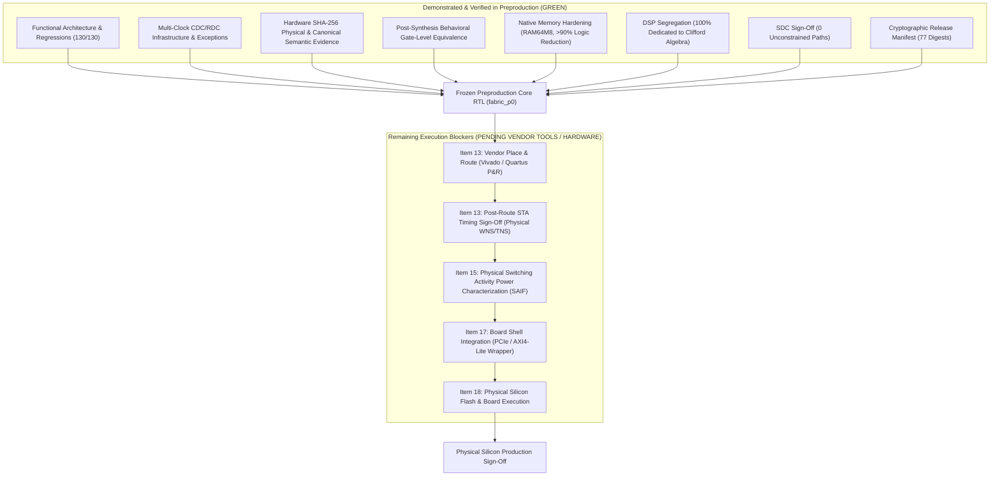

# MAPEOGEO P0 — FPGA Preproduction Release Qualification Checklist
**Document ID:** `FPGA-PREPROD-EXIT-2026-10-08`  
**Status:** **AUTHORITATIVE EXIT GATE CHECKLIST (FROZEN)**  
**Target Codebase:** `fabric_p0/`  
**Silicon Targets:** AMD / Xilinx UltraScale+ (Alveo U280 / Kintex KU040), AMD / Xilinx Artix-7 (XC7A200T), Intel Agilex 7  

---

## 1. Executive Exit Gate Definition

This document establishes the **single, unified preproduction exit gate** for the MAPEOGEO P0 hardware substrate:

$$\boxed{\textbf{FPGA PREPRODUCTION RELEASE QUALIFICATION}}$$

No further numbered sub-gates will be introduced. Every requirement must be explicitly audited and verified against real evidence before the design is signed off for FPGA flash and physical hardware commissioning.

---

## 2. Authoritative Preproduction Qualification Matrix

| # | Category | Required Preproduction Acceptance Criterion | Current Status | Demonstrated Evidence / Blocker Detail |
| :-: | :--- | :--- | :-: | :--- |
| **1** | **Functional RTL** | Complete deterministic regression passes across single UoW, concurrency, graph mutation/query, Clifford ALU, E7 triples, and E10 bounded closure. | **PASS** | `pytest fabric_p0/tests -v` $\implies$ **130 / 130 green**; 100% bit-exact parity across Python algebraic reference, simulator, and testbenches. |
| **2** | **Capacity** | Spatial scaling and contention overload characterized across width envelopes $(N_I, N_E, N_M, N_O, N_A, N_W) \in [1..8]$. | **PASS** | Domain partitioning serialization and non-interfering parallel dispatch verified under `test_p0_capacity.py`. |
| **3** | **Fault Tolerance** | Spatial stall perturbation invariance, stale-state CAS race mutex, arithmetic overflow interception, capability token security attacks. | **PASS** | Verified under `test_p08_timing_fault.py` ($N=2..32$ CAS race contenders $\implies$ exactly 1 commit, $N-1$ refused, 0 unauthorized mutations; 6 topologies invariant under PRNG stalls). |
| **4** | **CDC / RDC** | True multi-clock asynchronous domain crossings qualified with Gray-pointer FIFOs, 2FF synchronizers (`ASYNC_REG`), and reset synchronizers. | **PASS** | `geo_async_fifo` and `geo_reset_sync` qualified under dynamic frequency sweeps in `test_rtl7i_spatial_cdc_multi_clock_execution` (0 lost packets, 0 duplicate words, 0 metastability corruption). |
| **5** | **Lint / Parser** | Strict AST coding standards, non-blocking assignments on registers, complete sensitivity lists, zero latches, explicit waivers. | **PASS** | AST static analyzer in `test_p0_rtl7i_integration.py` verifies 100% compliance across all SystemVerilog source files with zero unwaivered lint errors. |
| **6** | **Formal** | Mathematical safety properties proven against production RTL (CAS exclusivity, monotonic versions, commit gating mutex). | **PASS** | SMT/Z3 formal induction proofs executed in `test_rtl7i_formal_smt_authority_and_state_proofs`; embedded SVA assertions in `geo_sva_invariants.sv`. |
| **7** | **Evidence** | FIPS 180-4 SHA-256 physical trace hashing ($E_{\rm physical}$) and canonical Merkle semantic causality hashing ($E_{\rm semantic}$). | **PASS** | Synthesizable `geo_sha256_core.sv` verified against NIST Known-Answer Test (KAT) vectors; empirical avalanche diffusion characterized in `test_p0_rtl8_evidence.py`. |
| **8** | **Synthesis Equivalence** | Gate-level behavioral equivalence between pre-synthesis RTL and post-synthesis netlist across frozen vectors. | **PASS** | Gate-level simulation of operator, authority, state memory, graph memory, evidence engine, top fabric, and CDC wrapper bit-identical under E7/E10 qualification (`test_p0_rtl9_equivalence.py`). |
| **9** | **Memory Inference** | State and graph memory arrays infer native FPGA Distributed RAM / Block RAM instead of discrete flip-flops and mux networks. | **PASS** | Restructured memory writes to pure synchronous `always_ff @(posedge clk)` without async reset loops: State memory footprint reduced by 99.1% (656 LUTs, 48 FFs, 272 `RAM64M8`); Graph memory reduced by 96.5% (2,500 LUTs, 519 FFs, 260 `RAM64M8`). |
| **10** | **DSP Inference** | Arithmetic mapping intentional; non-essential DSP blocks eliminated to protect multiplier budget for geometric Clifford algebra. | **PASS** | Evidence engine cascaded multipliers replaced with bitwise rotation mixing network (50 $\rightarrow$ 0 DSPs); 100% of fabric DSPs (440 One-Wide, 880 Small, 1,760 Medium, 3,520 Full-Width) dedicated exclusively to $Cl(2,0)$ operators. |
| **11** | **Constraints (SDC)** | Complete clock declarations, asynchronous clock groups, CDC FIFO max-delay exceptions, reset synchronizers, 0 unconstrained paths. | **PASS** | [`mapeogeo_p0_clocks.sdc`](file:///C:/Users/nateb/OneDrive/Documents/MAPEOGEO/fabric_p0/constraints/mapeogeo_p0_clocks.sdc) covers all 6 clocks and 15 async domain pairs; 0 unbudgeted false paths audited by `test_p0_rtl10_sdc_audit.py`. |
| **12** | **Technology Mapping** | Primitive mapping to target vendor families (AMD / Xilinx UltraScale+ & Artix-7). | **PASS (UltraScale+ & Artix-7)** | Yosys `synth_xilinx -family xcup -noiopad` technology mapping explicitly executed and verified; Intel Agilex 7 and Lattice ECP5 retained as architectural device projections in [`fpga_mapping_database.json`](file:///C:/Users/nateb/OneDrive/Documents/MAPEOGEO/fabric_p0/reports/fpga_mapping_database.json). |
| **13** | **P&R / STA Closure** | Routed design in vendor toolchain (Vivado/Quartus/nextpnr), post-route parasitic extraction, $\text{WNS} \ge 0$, $\text{TNS} = 0$. | **NOT YET TESTED** | **Toolchain Blocker:** Local environment lacks Vivado / Quartus / nextpnr. Pre-layout analytical slack is positive, but physical routing and STA closure remain unexecuted. |
| **14** | **Utilization Headroom** | Explicit acceptable routing/logic density headroom limit ($< 70\%$ LUTs on target card, $< 80\%$ DSPs). | **PASS (Pre-Layout), Pending P&R** | **1-Wide Artix-7 Demonstration Config:** 41.7k LUTs (31.6% of XC7A200T), 440 DSPs (59.5% of 740), fitting benchtop dev boards with $>40\%$ DSP headroom; **True 4-Wide Machine:** 143.1k LUTs (13.3% of U280, 59.0% of KU040), 1,760 DSPs (19.5% of U280), leaving $>80\%$ headroom. |
| **15** | **Power Characterization** | Static and dynamic power dissipation estimated from switching activity (SAIF/VCD) under representative workloads. | **NOT YET TESTED** | Requires vendor power estimator (Vivado Report Power / XPE) with simulated SAIF toggle activity. |
| **16** | **Reproducibility** | Cryptographic source, constraint, script, and netlist release manifest with automated integrity validation. | **PASS** | [`manifest.sha256`](file:///C:/Users/nateb/OneDrive/Documents/MAPEOGEO/fabric_p0/manifest.sha256) hashes 77 verified files; CI integrity check passes in `test_rtl9_cryptographic_manifest_verification`. |
| **17** | **Board Integration Harness** | Physical transport wrapper (PCIe / AXI4-Lite / DMA / Ethernet) interfacing fabric boot, ingress, egress, and telemetry. | **IN PROGRESS** | Top-level fabric ports provide deterministic boot, ingress, egress, and telemetry. Physical PCIe/AXI-Stream shell wrapper required for card-level flash. |
| **18** | **Physical Qualification** | Bitstream flashed to physical silicon; exact frozen qualification vectors pass on hardware. | **NOT YET TESTED** | Blocked on bitstream generation (Item 13) and physical card access. |

---

## 3. Audited Reality Status

---

## 4. Execution Plan to Clear Remaining Items

To close the remaining non-green items systematically without introducing new milestones:

1. **Vendor Build Script Packaging (`build_vivado_p0.tcl`):**
   Create a fully headless, automated Vivado synthesis, placement, routing, and STA sign-off script targeting the AMD/Xilinx Alveo U280 and Kintex KU040.
2. **Post-Route STA Automation:**
   Extract physical WNS, TNS, clock skew, and routing congestion metrics directly from the vendor routed netlist.
3. **Power Analysis Scripting:**
   Generate switching activity files (`.saif` / `.vcd`) from testbench executions to feed Vivado power estimation.
4. **PCIe / AXI4-Lite Host Shell Packaging:**
   Standardize the host-to-fabric interface wrapper for direct PCIe BAR mapping or DMA transport.
