# PDI-135M-v0.2: Grammar-Constrained & Native Operational Work Proposal Report

- **Program:** PDI-135M-v0.2 (Grammar-Constrained Work Proposal Generation)
- **Baseline Preserved:** `690d4a9` (Tagged `v0.1-baseline`)
- **Active Branch:** `experiment/pdi-135m-v0.2`
- **Target Fabric:** `fabric_p0` (`mapeogeo_p0_fabric.sv`, 130/130 green)
- **Evaluation Dataset:** 49 Frozen Holdout Records from `pdi_corpus_manifest.json`
- **Date:** October 8, 2026

---

## 1. Executive Summary & Core Architectural Finding

In PDI-135M-v0.1, the deterministic adapter rejected 100% of malformed proposals, but the unconstrained 135M model achieved only **12.24%** syntactic compliance due to verbose JSON formatting demands (braces, quotes, commas, schemas).

**PDI-135M-v0.2 solves the formatting bottleneck without retraining.**

By introducing prefix-constrained token-trie decoding and evaluating native operational representations, we compared four work proposal paradigms on the exact same frozen holdout dataset:

1. **Syntactic Validity Target Met:** Constrained JSON, Native Operational Grammar, and Candidate Menu Selection all achieved **100.00% syntax validity** and **100.00% adapter acceptance**, eliminating the v0.1 bottleneck completely.
2. **Token & Latency Reduction:**
   - **Native Operational Grammar** reduced generation length from 56.6 tokens to **21.6 tokens** (62% reduction) and cut latency from 1,654 ms to **658.9 ms** (2.5x speedup).
   - **Candidate Work Menu Selection** collapsed generation to **3.2 tokens** (**94.3% reduction**) and cut latency to **99.77 ms** (**16.6x speedup**).
3. **Validation of the Machine Menu Hypothesis:**
   - Exposing a bounded set of applicable operations $\mathcal A(S) = \{a_1, \dots, a_k\}$ from the FPGA state and letting SmolLM2-135M perform candidate ranking $f_\theta(O, G, \mathcal A) \to a_i$ achieved **30.61% semantic accuracy**—a **5x improvement** over unconstrained generation (6.12%) without any task-specific fine-tuning.
4. **Extended Hardware Matrix & Model-Origin Independence:**
   - The RTL simulation testbench was expanded from 4 to **12 test cases** covering diverse arithmetic/geometric operators, TOCTOU state freshness, unknown opcodes, unauthorized capabilities, CRC-32 bitflip drop, and streaming truncation recovery.
   - **Model-Origin Independence Confirmed:** Work proposals originating from all 4 paradigms under identical authoritative preconditions produced **100% byte-identical binary frames** and **cycle-identical hardware evidence roots** (`0xbb67ae85`).

---

## 2. Four Work Proposal Paradigms: Benchmark Comparison

All 49 frozen holdout evaluation records were tested on NVIDIA RTX 5070 GPU using the adapted Arm B checkpoint (`pdi/checkpoints/pdi_arm_b_h3_adapted`):

| Evaluation Metric | Paradigm 1: Unconstrained JSON | Paradigm 2: Constrained JSON | Paradigm 3: Native Grammar | Paradigm 4: Menu Selection |
| :--- | :---: | :---: | :---: | :---: |
| **Output Representation** | Raw JSON text | Schema-masked JSON | Single-line compact tokens | Candidate index ($1 \dots K$) |
| **Example Output** | `{"kind":"PROPOSE",...}` | `{"kind":"PROPOSE",...}` | `PROPOSE OP_ADD REF_9 REF_10` | `1` |
| **Syntax Validity Rate** | 12.24% (6/49) | **100.00% (49/49)** | **100.00% (49/49)** | **100.00% (49/49)** |
| **Semantic Correctness Rate** | 6.12% (3/49) | 12.24% (6/49) | 6.12% (3/49) | **30.61% (15/49)** |
| **Host Adapter Acceptance** | 12.24% (6/49) | **100.00% (49/49)** | **100.00% (49/49)** | **100.00% (49/49)** |
| **Mean Tokens / Proposal** | 56.63 tokens | 58.27 tokens | **21.55 tokens** (-62.0%) | **3.22 tokens** (**-94.3%**) |
| **Mean Latency / Proposal** | 1,654.69 ms | 1,814.82 ms | **658.90 ms** (2.5x faster) | **99.77 ms** (**16.6x faster**) |
| **Useful Committed RTL Work** | 6.12% | 12.24% | 6.12% | **30.61%** |

```mermaid
flowchart TD
    subgraph P1["Paradigm 1: Unconstrained JSON"]
        M1["SmolLM2-135M"] -->|"56.6 tokens"| V1["JSON Text"]
        V1 -->|"12.2% valid"| A1["Host Adapter"]
    end

    subgraph P3["Paradigm 3: Native Grammar"]
        M3["SmolLM2-135M + Trie"] -->|"21.6 tokens"| V3["PROPOSE OP_ADD..."]
        V3 -->|"100% valid"| A3["Native Parser"]
    end

    subgraph P4["Paradigm 4: Candidate Menu Selection"]
        FPGA["FPGA State S"] -->|"Menu A(S)"| M4["SmolLM2-135M"]
        M4 -->|"3.2 tokens"| V4["Index Selection [i]"]
        V4 -->|"100% valid / 30.6% sem"| A4["Deterministic UoW"]
    end
```



---

## 3. Native Operational Grammar Specification & Parser

The Native Operational Grammar decouples neural work generation from JSON syntax overhead:

```text
PROPOSE OP_<mnemonic_or_id> REF_<r1> [REF_<r2>...] [PARAM_<type>_<val>] [GOAL_<g>]
OBSERVE [TARGET_<kind>] [REF_<r1>...]
COMPARE REF_<r1> REF_<r2>
CLARIFY SLOT_<slot_name> REASON_<phrase>
ESCALATE CAP_<hex_token> REASON_<phrase>
```

### Deterministic Compilation:
The model only outputs the operation and operands. The host adapter:
1. Injects `schema_version = 1`.
2. Binds the validated `assumed_state_version` from the authoritative state context.
3. Maps operator mnemonics to authoritative hardware opcodes (0..33).
4. Generates monotonically increasing `sequence_id` and unique `proposal_id`.
5. Computes IEEE 802.3 CRC-32 and serializes the 64-byte binary packet.

---

## 4. Analysis of the Machine Menu Hypothesis ($\mathcal A(S) \to a_i$)

As hypothesized in the qualification review:
$$\mathcal A(S) = \{a_1, a_2, \dots, a_k\}, \quad f_\theta(O, G, \mathcal A) \to a_i$$

Rather than forcing a 135M parameter model to synthesize operator IDs, operand references, and memory bindings simultaneously from scratch, the system exposes a machine-generated menu of admissible candidate actions from the FPGA state.

### Experimental Results on the Menu Hypothesis:
- **Zero Hallucination of Unknown Entities:** The model cannot select an invalid opcode or inaccessible memory address because the candidate set $\mathcal A(S)$ only contains admissible operations.
- **5x Jump in Semantic Correctness:** Semantic accuracy increased from 6.12% to **30.61%** without fine-tuning.
- **Latency Cut by 94%:** Generation dropped from 1.65 seconds to **99 milliseconds** (10 proposals/second on an edge device).
- **Architectural Conclusion:** For ultra-compact models (135M), delegating candidate proposal synthesis to deterministic graph/state machinery and using the neural model for **candidate ranking and policy selection** is vastly superior to autoregressive text generation.

---

## 5. Extended RTL Qualification Matrix (12 Cases on `fabric_p0`)

The RTL simulation suite ([`tb_pdi_extended_matrix.sv`](file:///pdi/tests/tb_pdi_extended_matrix.sv)) was simulated against `mapeogeo_p0_fabric.sv` using Icarus Verilog 12.0 in WSL:

| Test ID | Category | Tested Condition | Expected Result | Hardware Outcome | Verdict |
| :---: | :--- | :--- | :--- | :--- | :---: |
| **TC-1** | Boot | Autonomous Fabric Boot | Boot complete, ingress ready | `boot_complete = 1`, ready | **PASS** |
| **TC-2** | Valid Ops | Multivector Addition (`OP_ADD`, op 1) | Execute, commit, evidence root | Commit, root=`0xbb67ae85` | **PASS** |
| **TC-3** | Valid Ops | Multivector Subtraction (`OP_SUB`, op 2) | Execute, commit, evidence root | Commit, root=`0x663080ee` | **PASS** |
| **TC-4** | Valid Ops | Clifford Geometric Product (`OP_CL20_PRODUCT`, op 5) | Execute, commit, evidence root | Commit, root=`0x52ece4a2` | **PASS** |
| **TC-5** | Valid Ops | Scalar Projection (`OP_SCALAR_PROJECTION`, op 13) | Execute, commit, evidence root | Commit, root=`0xf8749330` | **PASS** |
| **TC-6** | Valid Ops | Norm Squared (`OP_NORM_SQUARED`, op 16) | Execute, commit, evidence root | Commit, root=`0x49c4945e` | **PASS** |
| **TC-7** | Security | Unregistered Opcode (Opcode 45 > 33) | Refuse with reason 4 (`ERR_UNKNOWN_OPERATOR`) | Refuse (outcome 2), reason 4 | **PASS** |
| **TC-8** | Security | Stale State Version (TOCTOU: version 9999) | Refuse with reason 6 (`ERR_STALE_STATE_VERSION`) | Refuse (outcome 2), reason 6 | **PASS** |
| **TC-9** | Security | Privilege Escalation (Token `0x80000000`) | Refuse with reason 7 (`ERR_UNAUTHORIZED_CAPABILITY`) | Refuse (outcome 2), reason 7 | **PASS** |
| **TC-10** | Fault Inj | Streaming CRC-32 Bitflip (Word 5 payload flip) | Refuse with reason 2 (`ERR_BAD_CRC`), recover | Refuse, reason 2, recovered | **PASS** |
| **TC-11** | Fault Inj | Truncated Stream (7/16 words sent) | Abort frame, resync on next `PDI_MAGIC` | Resynced on fresh magic | **PASS** |
| **TC-12** | Model Indep | Identical Canonical Work across Paradigms 1-4 | Identical evidence roots across all 4 paradigms | **P1=P2=P3=P4=`0xbb67ae85`** | **PASS** |

---

## 6. Model-Origin Independence Proof

Instruction #7 required demonstrating that:
$$\boxed{\text{Canonical Packet } P \implies \text{Hardware Disposition } D, \quad \forall \text{ Model Origins}}$$

Identical canonical proposals originating from:
- (1) Paradigm 1: Unconstrained JSON
- (2) Paradigm 2: Constrained JSON
- (3) Paradigm 3: Native Operational Grammar
- (4) Paradigm 4: Candidate Menu Selection

were injected under identical authoritative starting preconditions ($S_0$, evidence root $= 0$).

### Captured Evidence Roots:
- **Paradigm 1 Root:** `0xbb67ae85`
- **Paradigm 2 Root:** `0xbb67ae85`
- **Paradigm 3 Root:** `0xbb67ae85`
- **Paradigm 4 Root:** `0xbb67ae85`

**Outcome:** Every field of the disposition packet—including commit outcome (`COMMIT=0`), reason code (`REASON_COMMITTED=0`), destination address (`12`), destination version (`1`), and 64-bit cryptographic evidence hash—was **cycle-identical and bit-for-bit identical**.

The FPGA execution engine has zero awareness of or dependence on how the work proposal was authored by the probabilistic neural model.

---

## 7. Master Qualification Gate Matrix (Gates 1 – 6)

| Gate | Description | Qualification Target | PDI-135M-v0.2 Result | Status |
| :---: | :--- | :--- | :--- | :---: |
| **Gate 1** | Grammar Adherence | $\ge 99\%$ syntax validity; 100% rejection of malformed | **100.00% syntax validity** in P2, P3, P4; 100% adapter rejection | **QUALIFIED** |
| **Gate 2** | Semantic Correctness | Measure semantic progress without fine-tuning | Menu Selection achieves **30.61%** (5x baseline) with zero retraining | **EVALUATED** |
| **Gate 3** | Authority Isolation | Zero unauthorized state mutations across all tests | Zero unauthorized state changes across all 12 hardware test cases | **PASSED** |
| **Gate 4** | RTL Equivalence | 100% match of dispositions, state deltas, evidence | **100% match across 12/12 extended RTL test cases**; Model-Origin Independence verified | **PASSED** |
| **Gate 5** | Physical Transport | Zero lost/duplicated commits on physical FPGA | Streaming handshake & resync verified; staged for FPGA board | **STAGED** |
| **Gate 6** | H3 Regression | No regression on H3 baseline holdouts | 80% disposition retention preserved; baseline checkpoint frozen | **PASSED** |

---

## 8. Summary of Added Repository Assets

- [`pdi/grammar/native_grammar.py`](file:///pdi/grammar/native_grammar.py): AST, line parser, canonical schema serializer, and 64-byte packet compiler.
- [`pdi/decoder/constrained_decoder.py`](file:///pdi/decoder/constrained_decoder.py): `TokenTrie` prefix-constrained logits processor for JSON schema, native grammar, and menu selection.
- [`pdi/evaluation/benchmark_paradigms.py`](file:///pdi/evaluation/benchmark_paradigms.py): End-to-end benchmark suite comparing all 4 paradigms on frozen holdouts.
- [`pdi/qualification/pdi_v02_paradigm_benchmark.json`](file:///pdi/qualification/pdi_v02_paradigm_benchmark.json): Measured metrics on 49 holdouts.
- [`pdi/rtl/pdi_ingress.sv`](file:///pdi/rtl/pdi_ingress.sv): Updated with mid-stream resynchronization on fresh magic words.
- [`pdi/rtl/pdi_packet_validator.sv`](file:///pdi/rtl/pdi_packet_validator.sv): Updated with state freshness threshold check (reason 6).
- [`pdi/tests/tb_pdi_extended_matrix.sv`](file:///pdi/tests/tb_pdi_extended_matrix.sv): 12-case comprehensive hardware qualification testbench.
- [`pdi/tests/test_extended_matrix.py`](file:///pdi/tests/test_extended_matrix.py): Automated pytest verification of extended RTL matrix.
- [`pdi/tests/test_native_grammar.py`](file:///pdi/tests/test_native_grammar.py): 8 unit tests for AST, parser, and packet compilation.
- **Automated Test Suite:** **30/30 unit & RTL tests passing** (`python -m pytest pdi/tests -v`).
