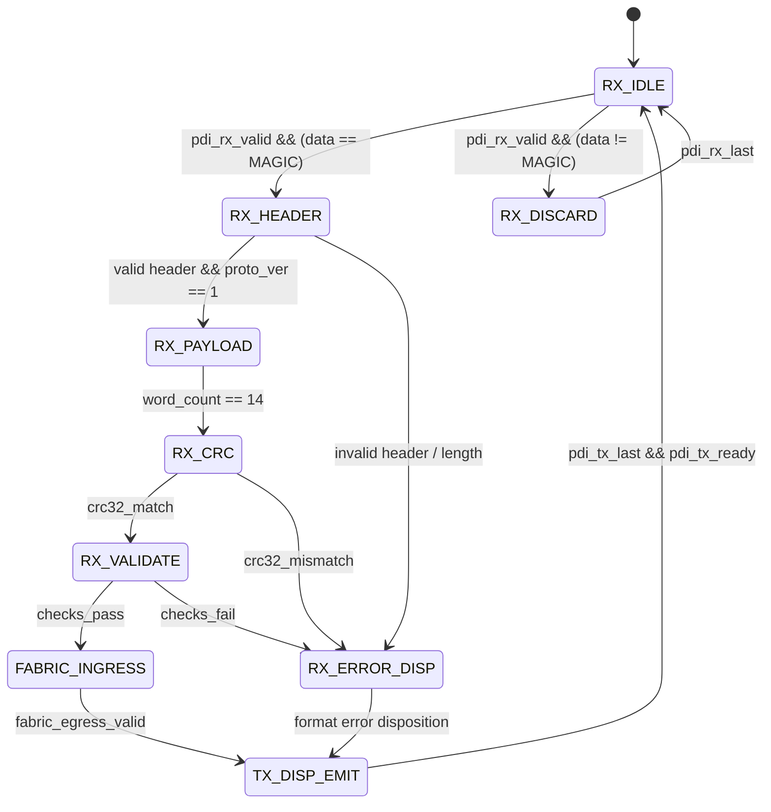

# Proposal-Disposition Interface (PDI) Protocol Specification v0.1

**Standard:** PDI-135M-v0.1 / PDP-v0  
**Transport Abstraction:** Transport-independent 32-bit streaming interface  
**Endianness:** Little-endian (byte and word order)  
**Boundary Law:** The FPGA fabric is the sole authoritative state and execution arbiter. Untrusted host models and parsers generate candidate proposals only.

---

## 1. Physical & Logical Interface Signals

The PDI hardware wrapper connects to the host transport controller via a synchronous 32-bit streaming handshake:

| Signal Name | Direction | Width | Description |
| :--- | :--- | :---: | :--- |
| `pdi_rx_valid` | Host $\to$ FPGA | 1 | Asserted when `pdi_rx_data` holds a valid word |
| `pdi_rx_ready` | FPGA $\to$ Host | 1 | Asserted when the FPGA ingress queue can accept a word |
| `pdi_rx_data`  | Host $\to$ FPGA | 32 | Packet data word |
| `pdi_rx_last`  | Host $\to$ FPGA | 1 | Asserted concurrently with the final word of an ingress packet |
| `pdi_tx_valid` | FPGA $\to$ Host | 1 | Asserted when `pdi_tx_data` holds a valid word |
| `pdi_tx_ready` | Host $\to$ FPGA | 1 | Asserted when the host transport can accept a response word |
| `pdi_tx_data`  | FPGA $\to$ Host | 32 | Disposition / evidence data word |
| `pdi_tx_last`  | FPGA $\to$ Host | 1 | Asserted concurrently with the final word of an egress packet |

### Handshake Rules
1. A transfer occurs on any rising edge of `clk` where both `valid` and `ready` are high.
2. Once asserted, the sender must hold `valid`, `data`, and `last` stable until the transfer completes.
3. If backpressured (`ready == 0`), the transmitter stalls without dropping or repeating words.

---

## 2. Binary Framing & Packet Structure

All packets begin with a 32-bit magic word and end with a standard CRC-32 (IEEE 802.3 polynomial `0xEDB88320`).

### 2.1 Packet Types (`pkt_type`)
- `0x01`: `PKT_PROPOSAL` (Host $\to$ FPGA)
- `0x02`: `PKT_DISPOSITION` (FPGA $\to$ Host)
- `0x03`: `PKT_OBSERVE_REQ` (Host $\to$ FPGA)
- `0x04`: `PKT_OBSERVE_RESP` (FPGA $\to$ Host)
- `0x05`: `PKT_ERROR_ALERT` (FPGA $\to$ Host)

### 2.2 Proposal Packet Layout (`PKT_PROPOSAL`, 16 Words / 64 Bytes)

| Word Index | Bit Range | Field Name | Description |
| :---: | :---: | :--- | :--- |
| **0** | `[31:0]` | `magic` | Magic header constant: `0x50444930` (`"PDI0"`) |
| **1** | `[7:0]` `[15:8]` `[31:16]` | `pkt_type` `proto_ver` `total_words` | Type (`0x01`), Protocol Version (`1`), Length in words (`16`) |
| **2** | `[31:0]` | `seq_id` | Monotonic transport sequence number assigned by host |
| **3** | `[31:0]` | `proposal_id` | Unique proposal identifier (maps to candidate `uow_id`) |
| **4** | `[31:0]` | `assumed_state_version` | State version assumed by model / host context |
| **5** | `[5:0]` `[7:6]` `[15:8]` `[23:16]` `[31:24]` | `opcode` `reserved` `dest_addr` `src_a_addr` `src_b_addr` | Registered operator opcode (`0..33`), Destination state address (`0..255`), Source A address (`0..255`), Source B address (`0..255`) |
| **6** | `[31:0]` | `auth_token` | Granted capability token assigned by authenticated host |
| **7** | `[0]` `[1]` `[4:2]` `[31:5]` | `use_immediate` `has_graph_mut` `dep_cond` `reserved` | 1 = use immediate for operand B, 1 = graph mutation present, Dependency condition type (`0..4`) |
| **8** | `[31:0]` | `imm_s` | Immediate operand scalar component (signed Q16.16) |
| **9** | `[31:0]` | `imm_e1` | Immediate operand $e_1$ component (signed Q16.16) |
| **10** | `[31:0]` | `imm_e2` | Immediate operand $e_2$ component (signed Q16.16) |
| **11** | `[31:0]` | `imm_e12` | Immediate operand $e_{12}$ component (signed Q16.16) |
| **12** | `[15:0]` `[23:16]` `[31:24]` | `graph_start_node` `graph_rel_filter` `graph_type_filter` | Graph query parameters / mutation source node |
| **13** | `[1:0]` `[3:2]` `[19:4]` `[27:20]` `[31:28]` | `graph_radius` `graph_mut_cmd` `graph_mut_target` `graph_mut_rel` `graph_mut_flags` | Graph query radius, mutation command, mutation target node, relation, flags |
| **14** | `[31:0]` | `reserved` | Bounded reserved field for future fabric expansion |
| **15** | `[31:0]` | `crc32` | Standard CRC-32 over words 0 through 14 |

---

### 2.3 Disposition Packet Layout (`PKT_DISPOSITION`, 16 Words / 64 Bytes)

| Word Index | Bit Range | Field Name | Description |
| :---: | :---: | :--- | :--- |
| **0** | `[31:0]` | `magic` | Magic header constant: `0x50444930` (`"PDI0"`) |
| **1** | `[7:0]` `[15:8]` `[23:16]` `[31:24]` | `pkt_type` `proto_ver` `outcome` `reserved` | Type (`0x02`), Protocol Version (`1`), Outcome: COMMIT (0), REJECT (1), REFUSE (2), FAULT (3) |
| **2** | `[31:0]` | `seq_id` | Echo of sequence number from proposal packet |
| **3** | `[31:0]` | `proposal_id` | Echo of proposal identifier |
| **4** | `[31:0]` | `reason_code` | Deterministic disposition / refusal reason code |
| **5** | `[7:0]` `[23:8]` `[31:24]` | `dest_addr` `dest_version` `failed_check_mask` | Target address, resulting monotonic version, and 8-bit failed check bitmask |
| **6** | `[31:0]` | `result_s` | Execution result scalar component |
| **7** | `[31:0]` | `result_e1` | Execution result $e_1$ component |
| **8** | `[31:0]` | `result_e2` | Execution result $e_2$ component |
| **9** | `[31:0]` | `result_e12` | Execution result $e_{12}$ component |
| **10** | `[31:0]` | `evidence_root_lo` | Lower 32 bits of authoritative Merkle evidence root |
| **11** | `[31:0]` | `evidence_root_hi` | Upper 32 bits of authoritative Merkle evidence root |
| **12** | `[31:0]` | `telemetry_cycles` | Execution cycle latency count |
| **13** | `[31:0]` | `telemetry_ops` | Total operations executed counter |
| **14** | `[31:0]` | `cert_id` | Hardware certification sequence ID |
| **15** | `[31:0]` | `crc32` | Standard CRC-32 over words 0 through 14 |

---

## 3. Reason Codes & Fault Classification

When a candidate proposal cannot be committed, the FPGA fabric or ingress validator emits a structured disposition with an exact reason code:

| Code | Identifier | Description | Outcome |
| :---: | :--- | :--- | :---: |
| `0` | `REASON_COMMITTED` | Proposal successfully validated, certified, and committed | `OUTCOME_COMMIT` |
| `1` | `ERR_BAD_MAGIC` | Ingress header magic does not match `0x50444930` | `OUTCOME_REFUSE` |
| `2` | `ERR_BAD_CRC` | CRC-32 mismatch detected during frame reassembly | `OUTCOME_REFUSE` |
| `3` | `ERR_BAD_LENGTH` | Packet length word disagrees with fixed contract bound | `OUTCOME_REFUSE` |
| `4` | `ERR_UNKNOWN_OPERATOR` | Opcode is not present in authoritative operator registry | `OUTCOME_REFUSE` |
| `5` | `ERR_OUT_OF_BOUNDS_REF` | Memory address $\ge 256$ or graph node $\ge \text{GRAPH\_NODES}$ | `OUTCOME_REFUSE` |
| `6` | `ERR_STALE_STATE_VERSION` | Assumed state version disagrees with authoritative memory version | `OUTCOME_REFUSE` |
| `7` | `ERR_UNAUTHORIZED_CAPABILITY` | Required capability token not covered by authorized capability mask | `OUTCOME_REFUSE` |
| `8` | `ERR_UNSATISFIED_DEPENDENCY` | Specified antecedent cell dependency mask not satisfied | `OUTCOME_REFUSE` |
| `9` | `ERR_RESOURCE_EXHAUSTION` | All fabric work cells or queues currently full | `OUTCOME_REFUSE` |
| `10` | `ERR_REPLAY_DUPLICATE` | Sequence number or proposal ID already committed | `OUTCOME_REFUSE` |
| `11` | `ERR_ARITHMETIC_FAULT` | Operator triggered fixed-point overflow or nullification | `OUTCOME_FAULT` |
| `12` | `ERR_CONDITION_REJECT` | Semantic or dependency condition evaluated false | `OUTCOME_REJECT` |

---

## 4. Ingress / Egress State Machine & Framing Recovery

### Framing Recovery Rules
- If an unexpected word or framing error occurs, the receiver transitions to `RX_DISCARD` until `pdi_rx_last` is asserted, resetting the state to `RX_IDLE`.
- A framing error immediately triggers an `ERR_BAD_MAGIC` or `ERR_BAD_CRC` disposition without mutating any internal state registers.
